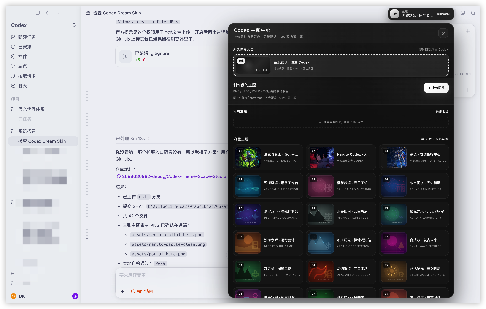
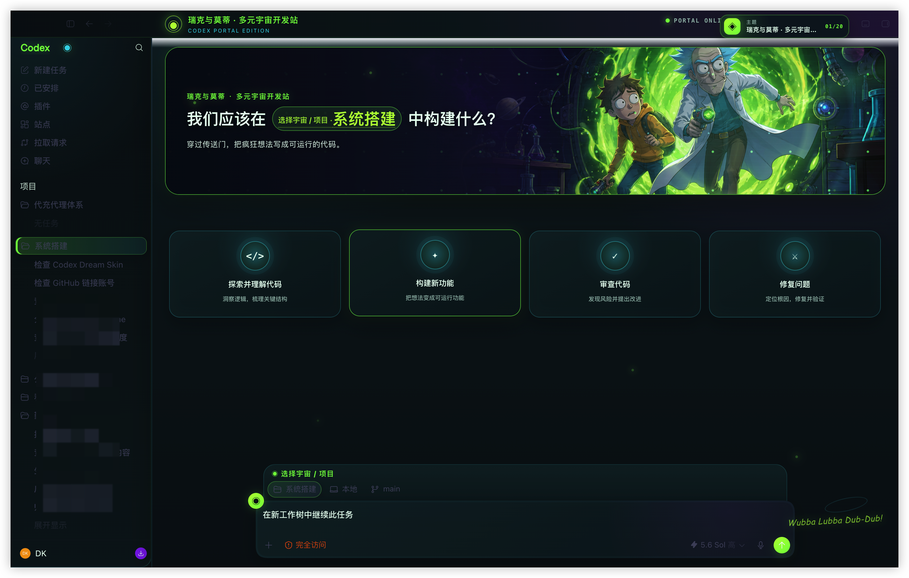
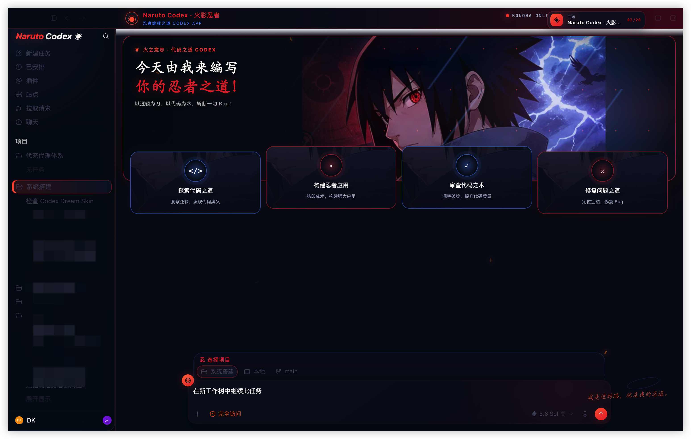
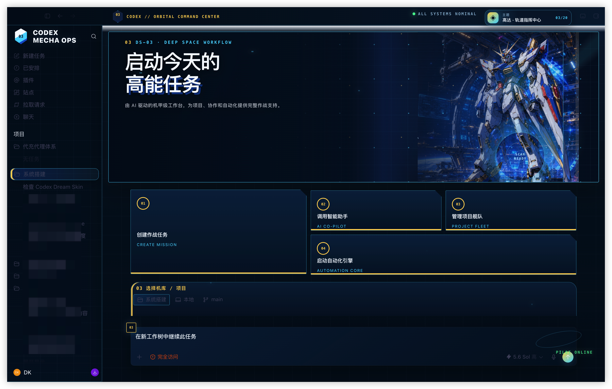
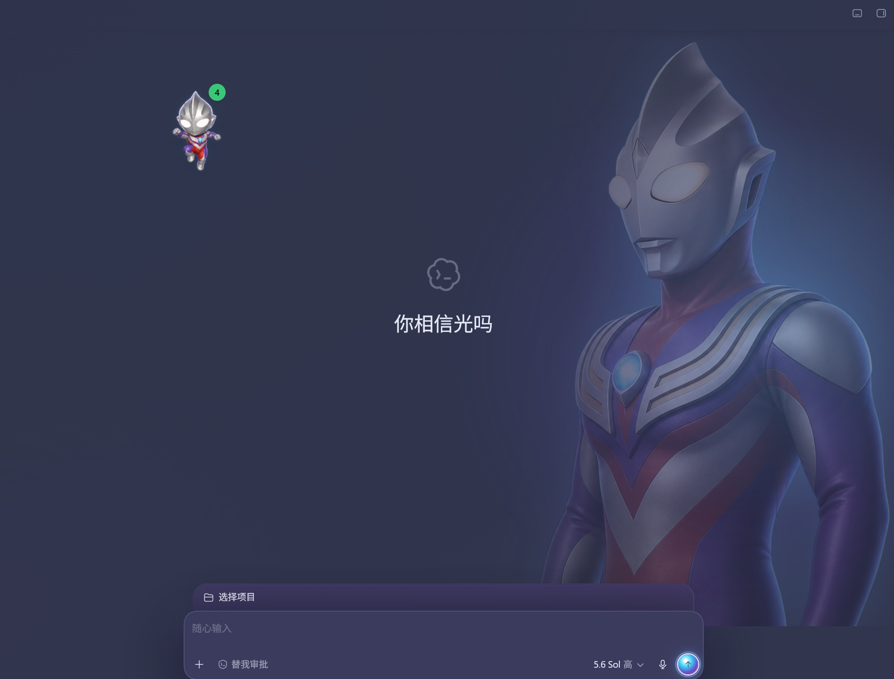

# Codex Dream Skin Studio

macOS Codex 的多布局动态主题切换器与自定义主题编辑器：右上角打开“Codex 主题中心”即可一键切换 20 款内置主题，第 1 款是瑞克与莫蒂，第 2 款是火影忍者，第 3 款是蓝白高达轨道指挥中心。主题中心最上方永久保留“系统默认 · 原生 Codex”，客户可随时清除皮肤并回到官方界面。客户可以在页面内上传图片，自动压缩、取色、选择布局并保存为额外“我的主题”。20 套内置主题分别拥有火花、雷电碎屑、扫描、气泡、花瓣、雨、星际光迹、烟雾、沙尘、雪、萤火、火星、蒸汽、彩纸、数字雨或流星等独立环境特效；原画始终固定，普通任务页使用全幅素材，同时保留 Codex 原生侧栏、项目选择器、任务内容和输入框。Codex 提供原生建议卡时直接沿用；当前版本未提供时使用可把任务写入原生输入框的真实 DOM 备用卡。

项目通过本机回环 CDP 动态注入，不修改官方 `.app`、`app.asar` 或代码签名。刷新、切换任务和 Codex 重启后可持续重新应用，并提供一键恢复。

## 实机效果

### 主题中心与 20 套内置主题



### 瑞克与莫蒂 · 多元宇宙开发站



### Naruto Codex · 火影忍者



### 高达 · 轨道指挥中心



<details>
<summary>客户化主题视觉参考（非内置主题）</summary>




</details>

## 最简单的使用方式

1. 解压整个项目文件夹，不要只复制 CSS 或图片。
2. 双击 `Install Codex Dream Skin.command`。首次安装会复制到 `~/.codex/codex-dream-skin-studio` 并在桌面创建四个入口。
3. 在 Codex 页面右上角点击“主题”，选择系统默认或 20 款内置主题；第 2 款为火影忍者，第 3 款为蓝白高达轨道指挥中心。
4. 如需使用自己的素材，在主题中心点击“上传图片”，选择 PNG、JPEG 或 WebP。图片会在本机压缩、自动取色；确认主题名、模块布局和颜色后点击“保存并应用”。
5. Codex 只会在首次启用 CDP 且得到确认后重启一次；以后从桌面的 `Codex Dream Skin.command` 启动。

桌面入口：

- `Codex Dream Skin.command`：启动或重新应用主题；
- `Codex Dream Skin - Customize.command`：兼容旧流程的 Finder 选图导入；
- `Codex Dream Skin - Verify.command`：执行真实 CDP 自检并保存截图；
- `Codex Dream Skin - Restore.command`：移除主题、恢复原始基础配色并正常启动 Codex。

主题选择会保存在 Codex 本机存储中，刷新、切换任务或重新启动后仍保留上次选择。页面内上传的图片会先缩放到 1600×1000 范围并压缩成 WebP，再保存在 Codex 本机 IndexedDB；最多保存 12 款，可从主题卡右上角删除。图片处理不访问网络。固定在主题中心最上方的“系统默认”会清除主题根类、背景、横幅、附加任务卡和装饰 DOM，只保留主题入口以便再次启用。20 款内置主题始终保留；客户上传的自定义图片不会覆盖任何内置主题。

动态背景不使用视频，也不会移动整张界面或素材原画。只有独立环境光、粒子、烟雾、碎屑和扫描层运动，所有装饰层均不接收点击。20 套内置主题拥有 20 个唯一特效配置；上传主题会根据本机提取的配色和所选布局自动匹配特效。macOS 开启“减少动态效果”后，动画会自动静止，无需额外设置。

内置主题分属六种布局家族：电影横幅、沉浸任务板、控制台、轨道指挥中心、编辑画册和极简聚焦。瑞克与莫蒂使用电影横幅；火影忍者使用更高横幅、放大佐助和任务卡压住横幅底部的沉浸任务板；第 3 款高达主题使用独立轨道指挥中心布局、蓝金状态栏、全身机体横幅和横排 01–04 作战任务卡，不再只是同一模板换图换色。

## 页面内素材要求

- 支持 PNG、JPEG 和 WebP；HEIC/TIFF 可继续通过兼容的 Customize 启动器导入；
- 原文件不超过 50 MB，压缩后不超过 5 MB，至少 320×180；
- 横向图片效果最好，建议宽度 1600 px 以上；
- 左侧保留较安静的区域，会更适合叠加主页原生标题；
- 图片只作为横幅和背景，不会作为整张界面截图覆盖原生控件。

主题名和三种强调色也可以通过命令行设置：

```bash
~/.codex/codex-dream-skin-studio/scripts/customize-theme-macos.sh \
  --image "/path/to/image.png" \
  --name "我的主题" \
  --accent "#7cff46" \
  --secondary "#36d7e8" \
  --highlight "#642a8c"
```

移除“我的主题”并回到内置主题：

```bash
~/.codex/codex-dream-skin-studio/scripts/customize-theme-macos.sh --reset-demo
```

## 自检

静态、配置往返和官方签名检查：

```bash
./tests/run-tests.sh
```

检查已启动的真实主题：

```bash
~/.codex/codex-dream-skin-studio/scripts/doctor-macos.sh --require-live
~/.codex/codex-dream-skin-studio/scripts/verify-dream-skin-macos.sh \
  --reload --screenshot "$HOME/Desktop/Codex Dream Skin Verification.png"
```

验证器不会只检查“脚本是否运行”。它会检查原生侧栏、输入框、主页横幅、原生建议卡或四张交互式备用任务卡、项目选择器、横向溢出、右上角主题按钮、永久系统默认入口、20 款内置数量、火影忍者是否位于第 2 项，以及装饰层是否拦截点击。动态验收会实际比较两个时间点的特效时间线；`--test-all-effects` 会逐一切换 20 套并核对 20 个唯一映射、原画固定与动画运行。普通任务页必须全幅覆盖。第 3 款高达主题另需确认全身机体横幅和非对称 01–04 任务卡可见。系统默认状态下还会确认主题根类和附加装饰已清除。

完整测试页面内上传、自动取色、预览、保存、布局应用、删除和原主题恢复：

```bash
~/.codex/codex-dream-skin-studio/scripts/test-theme-studio-macos.sh
```

## 工作原理与安全边界

- 动态发现 Bundle ID 为 `com.openai.codex` 的官方应用；
- 验证应用及其 Node.js 的代码签名、OpenAI Team ID、CPU 架构和 Node.js 版本；
- 通过用户级 `launchd` 启动官方可执行文件，并只在 `127.0.0.1` 开启 CDP；
- 只接受由 Codex 主进程或合法子进程持有的监听端口；
- 只向包含预期 Codex 原生结构的 `app://` 页面注入；
- 使用用户级 LaunchAgent 常驻注入器处理刷新、路由切换和渲染器重建，并用独立看门程序处理普通 Dock 启动；
- 页面上传只使用 Canvas、Blob 和 IndexedDB，拒绝 SVG/远程 URL，不发送客户图片；
- 恢复时核对 PID、启动时间、Node 路径和注入器路径，避免误停其他进程。

CDP 端口是仅限本机但未认证的调试接口。主题运行期间不要执行来源不明的本地程序；使用 Restore 入口可关闭主题会话和调试端口。

## 文件位置

- 安装目录：`~/.codex/codex-dream-skin-studio`
- 状态、日志和用户图片：`~/Library/Application Support/CodexDreamSkinStudio`
- Codex 基础主题备份：上述状态目录内的 `theme-backup.json`

项目不会备份或修改 `app.asar`，因为它从不写入官方应用包。

## 故障排查

- 找不到配置：先正常启动一次 Codex，再重新安装。
- Codex 签名无效：恢复或重新安装官方 Codex；项目会拒绝继续。
- Codex 更新后界面没有主题：从桌面重新运行 `Codex Dream Skin.command`，再执行 Verify。
- 验证失败：查看 `~/Library/Application Support/CodexDreamSkinStudio/injector-error.log` 和 `start-error.log`。
- 端口 9341 被占用：启动器会在 9341–9441 中选择空闲端口并写入状态文件。

## 支持范围

2.7.0 面向 macOS Codex Desktop。项目不依赖全局 Node.js，也不包含超过 100 MB 的运行时二进制。Codex 升级若移除内部签名 Node 或改变关键原生结构，项目会失败关闭并要求更新适配，而不会盲目修改应用。

代码采用 MIT License。示例人物视觉不随 MIT 软件许可证授予角色、商标或商业分发权，详见 `NOTICE.md` 与 `references/asset-provenance.md`。

主页、系统默认、主题中心和任务页截图均由运行中的 Codex 渲染器通过 CDP 实际截取，不是静态 HTML 预览。2.7.0 的 20 套独立环境特效、固定原画和实机检查见 `references/acceptance-report-2.7.0-2026-07-17.md`；2.6.0 的高达非对称任务区检查见 `references/acceptance-report-2.6.0-2026-07-17.md`。
